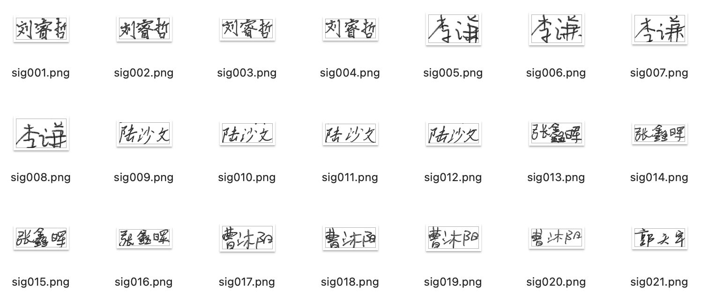

# LZUSig

Anonymous review repository for the LZUSig dataset used with the FGSA framework.

## Overview

LZUSig is a large-scale Chinese handwritten signature dataset designed for studying fine-grained structural degradation in handwriting and signature analysis. It focuses on real degradation patterns produced by natural signing dynamics, including cross-character adhesion, mid-stroke breakage, and local structural loss.

## Highlights

- **Task focus:** Chinese handwritten signature recognition, structure-aware augmentation, fine-grained degradation analysis, and handwriting robustness evaluation.
- **Scale:** 1,623 participants, 6,274 original signature images, and approximately 19,000 characters after adaptive segmentation and annotation.
- **Acquisition protocol:** Physical-paper signing with 0.5-mm gel pens, followed by 1200-dpi scanning.
- **Degradation annotations:** Cross-character adhesion, mid-stroke breakage, and local structural loss.
- **Recommended split:** Signer-dependent but sample-disjoint train/test split with a 4:1 ratio. Augmented samples must be generated only from the training subset.

## Dataset Preview



## Repository Structure

```text
LZUSig/
├── README.md
├── LICENSE_DATA.md
├── CITATION.cff
├── assets/
│   └── dataset_preview.png
└── data/
    ├── images/
    ├── train_labels.txt
    ├── test_labels.txt
    └── all_labels.txt
```

## Data Organization

All dataset files are placed under the `data/` directory.

- `data/images/`: image files.
- `data/train_labels`: labels for the training split.
- `data/test_labels`: labels for the test split.
- `data/all_labels`: labels for the full dataset.

## Anonymous Review Notes

This repository is prepared for anonymous review. All filenames and labels use anonymous sample IDs. No author names, participant identities, affiliations, original filenames, or collection metadata are included.

## License

The dataset is released for non-commercial academic research only. See `LICENSE_DATA.md`.

## Citation

For anonymous review, please cite this dataset using `CITATION.cff`.
